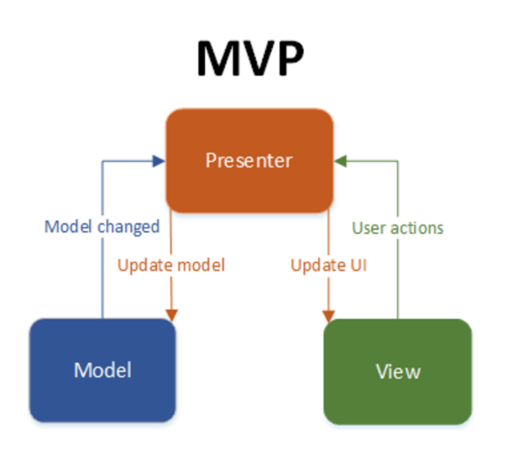
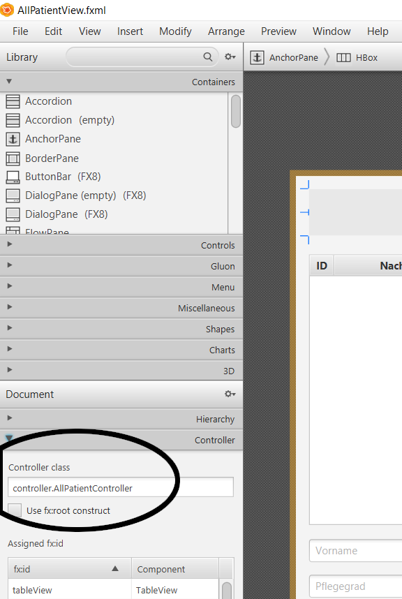
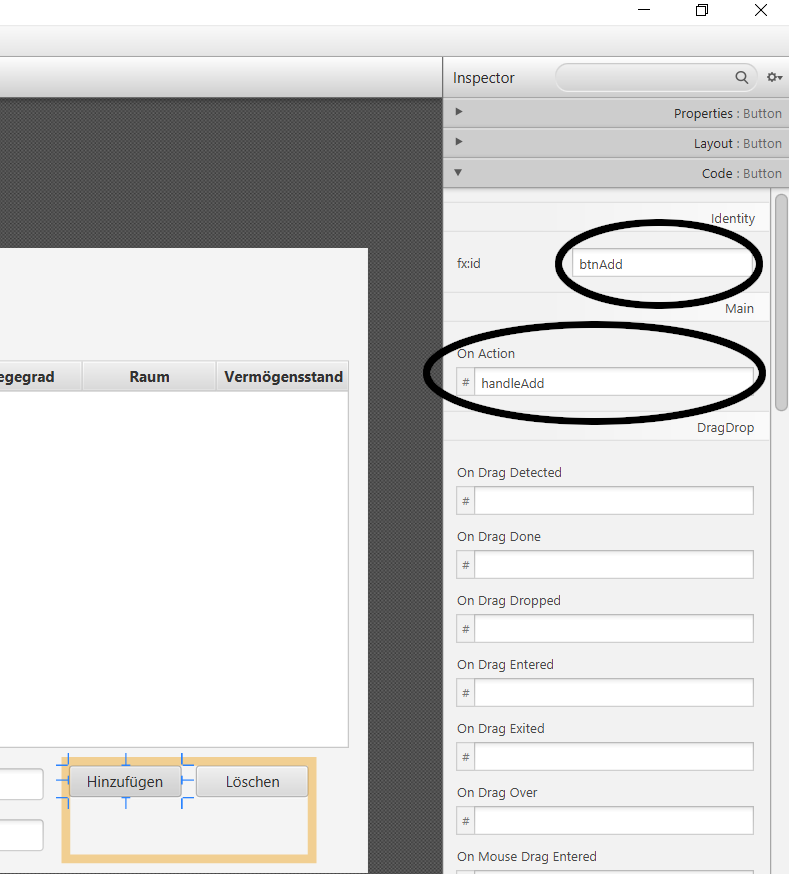

# MVP-Pattern allgemein

<div style="display: flex; align-items: center;">
  <p style="text-align: justify;">Das MVP-Entwurfsmuster ist eine Abwandlung des MVC (Model-View-Controller). Es trennt das Model komplett von dessen Ansicht in der View und verbindet beide Schichten über einen sogenannten Presenter. Über eine sehr strenge Trennung der Schichten wird die Anwendung besser testbar und wartbar. Das Model definiert die in der View anzuzeigenden Daten. Es kann auch die Geschäftslogik der Anwendung enthalten. Die View ist lediglich für die Anzeige der Daten in der GUI zuständig. Sie enthält keinerlei Geschäfts- oder Anzeigenlogik, sondern nimmt Benutzeranforderungen des Benutzers entgegen und gibt sie an den Presenter weiter. Der Presenter interagiert zwischen Model und View, indem er auf die ihm übergebenen Ereignisse reagiert, das Model liest, aktualisiert und in umgekehrter Richtung dafür sorgt, dass die Daten in der View aktualisiert dargestellt werden. Zu jeder View gibt es immer nur einen Presenter, der in der View initiiert wird.  Normalerweise sind View und Presenter über ein Interface voneinander entkoppelt.</p>
  
</div>

---

## MVP in JavaFX

### View
<div style="display: flex; justify-content: space-between; align-items: flex-start;">
    <div></div>
    <div style="flex: 1; text-align: justify;">
        <p style="text-align: justify; margin-right: 10px;">
                In JavaFX werden GUIs über sogenannte FXML-Dateien, einer Abwandlung des XML-Formats, beschrieben. Im NH-Plus-Projekt findest du alle Views im Ordner resources und kannst den Quellcode wie gewohnt über einen Doppelklick einsehen. Alternativ können FXML-Dateien mit einem Rechtsklick und der Auswahl Open In Scene Builder im in IntelliJ integrierten Scene Builder als grafische Benutzeroberfläche angezeigt und bearbeitet werden.
        </p>
        <p style="text-align: justify;">
                Um die View mit dem Presenter zu verknüpfen wird unten links im  SceneBuilder im Bereich Controller (vgl. Abbildung rechts) die Javaklasse, die den zur View gehörenden Presenter repräsentiert, registriert.  In der Anwendung NH-Plus wurden die Presenter Controller genannt, weil sie zusätzlich zur Anzeigensteuerung für die Speicherung und Aktualisierung der Daten in der Datenbank zuständig sind. Da alle Presenter im Package controller liegen, wird der Name dieses Packages vorangestellt.
        </p>
        <p style="text-align: justify; margin-right: 10px;">
                Damit die View Benutzeraufforderungen an den Presenter weitergeben kann, wird rechts im Scene Builder im Bereich Code beim gewünschten Ereignis der Name der Methode im Presenter eingetragen, die ausgeführt wird, sobald der Benutzer das entsprechende Ereignis in der GUI auslöst. Im rechts abgebildeten Beispiel wird die Methode handleAdd() vom Presenter ausgeführt, sobald der Benutzer auf den Button Hinzufügen klickt. Um einen Methodennamen eintragen zu können, muss das gewünschte Steuerelement in der GUI per Mausklick ausgewählt werden.
        </p>
  </div>
    <!-- Rechte Spalte für das Bild -->
  <div>
            
  </div>
</div>

<div style="display: flex; justify-content: space-between; align-items: flex-start;">
    <div style="flex: 1; text-align: justify;">
        <p style="text-align: justify;">
                Damit in umgekehrter Richtung der Presenter Zugriff auf Komponenten der GUI besitzt, um zum Beispiel Daten in der GUI zu aktualisieren, bekommen die entsprechenden GUI-Komponenten eine fx-id, im Beispiel btnAdd.
        </p>
        <p style="text-align: justify;">
                Alternativ können Controller, Methodennamen und fx-id auch händisch in die FXML-datei eingetragen werden.
        </p>
  </div>
    <!-- Rechte Spalte für das Bild -->
  <div>
            
  </div>
</div>

### Presenter

<p style="text-align: justify;">Der zur jeweiligen View gehörende Presenter wird aus der FXML-Datei geladen und initialisiert. Das geschieht für den Presenter AllPatientController im MainWindowController durch das Codeschnipsel </p>

```
AllPatientController controller = loader.getController();
```

<p style="text-align: justify;">Dabei wird automatisch die Methode initialize() aus der Klasse AllPatientController aufgerufen. Diese muss nur explizit aufgerufen werden, sofern sie vom Presenter überladen wird, ihr Aufruf also Parameter erfordert.</p>

<p style="text-align: justify;">Um die 1:1-Beziehung des Presenters zur View zu realisieren, wird jedes Steuerungselement, auf das der Presenter Zugriff benötigt, als Instanzvariable deklariert und mit der Annotation FXML versehen; am Beispiel des oben schon erwähnten Buttons Hinzufügen und des  Textfeldes, das den Nachnamen anzeigt:</p>

```
@FXML
Button btnAdd;

@FXML
TextField txtSurname;
```
<p style="text-align: justify;">Auch die Methoden, die ausgeführt werden sollen, sobald der Benutzer ein bestimmtes Ereignis auf der View auslöst, müssen mit der Annotation FXML versehen werden. Im unten abgebildeten Beispiel werden zunächst aus den Textfeldern der GUI - die im Presenter also alle als Instanzvariablen mit dem Bezeichner der im Scene Builder angegebenen fx-id und mit der Annotation FXML deklariert sein müssen - mithilfe der Methode getText() die in der View eingetragenen Strings ausgelesen. Im zweiten Schritt wird ein neues Patientenobjekt erstellt und mithilfe des DAOs in die Datenbank geschrieben. Zuletzt wird die Anzeige der View aktualisiert. Das geschieht hier (zugegeben ein wenig inperformant), indem alle Patienten erneut aus der Datenbank gelesen werden, in der TableView angezeigt und die Textfelder zum Anlegen eines neuen Patienten wieder geleert werden.</p>

```
@FXML
public void handleAdd() {
    String surname = this.txtSurname.getText();
    String firstname = this.txtFirstname.getText();
    String birthday = this.txtBirthday.getText();
    LocalDate date = DateConverter.convertStringToLocalDate(birthday);
    String carelevel = this.txtCarelevel.getText();
    String room = this.txtRoom.getText();
    String assets = this.txtAssets.getText();
    try {
        Patient p = new Patient(firstname, surname, date, carelevel, room, assets);
        dao.create(p);
    } catch (SQLException e) {
        e.printStackTrace();
    }

    readAllAndShowInTableView();
    clearTextfields();
}
```
<p style="text-align: justify;">Der Presenter benötigt zur Anzeigensteuerung der View und zur Aktualisierung des Models Zugriff auf letzteres, in unserem Fall also auf alle Patientendaten. Patienten werden in unserer Anwendung durch eine übliche Javaklasse mit dem bezeichner Patient modelliert. Um die Patienten in einer TableView anzeigen zu lassen, verwendet der Presenter keine übliche Liste, sondern eine von JavaFX bereitgestellte ObservableList, die von der TableView gefordert wird:</p>

```
private ObservableList<Patient> tableviewContent = FXCollections.observableArrayList();
```